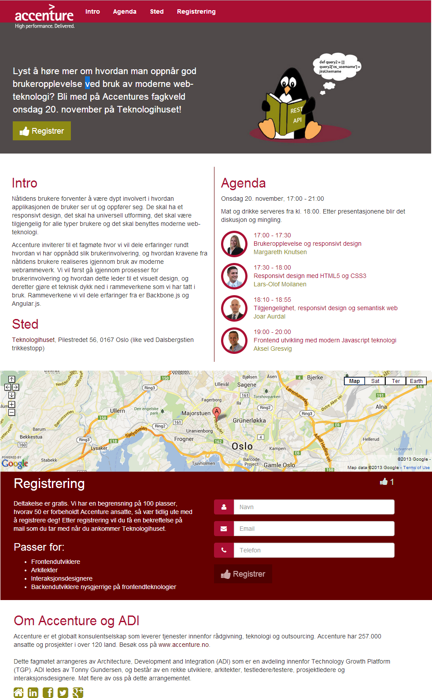

## Screenshot of the event registration page

## Prerequisites:
1. Install node (google it)
1. Install npm (google it)
1. Install mongodb (google it)
1. Install Ruby (google it)
1. Make sure that Ruby is installed correctly by running ruby --version from the terminal (make sure that PATH is set)
1. Install compass gem: `gem install compass`
1. Install grunt: `sudo npm install -g grunt`
1. Install bower: `sudo npm install -g bower`

## To start development:
1. Check out this repo: `git clone git@github.com:acntech/acn-events.git`
1. Go to repo: `cd acn-events`
1. Download node dependencies (build time): `npm install`
1. Download web app dependencies (run time): `bower install`

## To start the server:
1. Run this command: `grunt server`

## To deploy to Heroku:
1. Prerequisites:
22. A Heroku user account. [Signup is free and instant](https://api.heroku.com/signup/devcenter).
23. Install the [Heroku Toolbelt](https://toolbelt.heroku.com/), which gives you git, Foreman, and the Heroku command-line interface.
1. git remote add heroku <heroku git url>
2. git push heroku master

## To contact the developers:
The developers of this app chat at the acnteck room at IRC:
http://webchat.freenode.net/?channels=acntech&nick=

( Link for auto connecting without writing the nick every time:
	http://webchat.freenode.net/?channels=acntech&nick=>>your_name_here<< )
